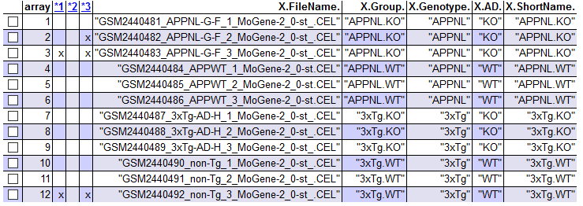
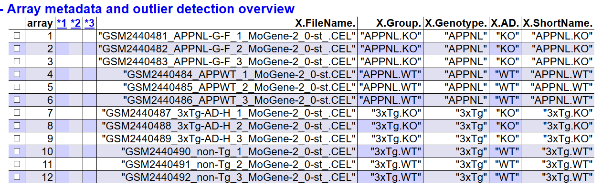

```{r setup, include=FALSE}
knitr::opts_chunk$set(echo = TRUE)
getwd()
```

## Abstract

En este estudio se tomó una muestra de 12 ratones machos de las especies AppNLG-F/NL-G-F y 3xTg-AD-H, en sus versiones transgénicas y salvajes de entre 7 meses y 1 año de edad, publicadas por Nakabeppu & Castillo (2017). Se destaca que las versiones transgénicas cuentan con mutaciones patogénicas que producen una amiloidosis agresiva y genes humanos sobreexpresados que generan Alzheimer en los ratones.

Estos datos fueron utilizados para identificar el conjunto de genes diferencialmente expresados entre las versiones mutantes y de control de cada una de las especies.

### Código de los datos: GSE92926

### Repositorio en GitHub: https://github.com/alcastaro/PEC-1---Omics

## Contexto

El Alzheimer es la enfermedad neurodegenerativa más frecuente del planeta. Tan solo en Europa, esta enfermedad tiene una prevalencia del 5.05%, afectando mayoritariamente a las mujeres (7.13%). En este contexto, se prevé un incremento progresivo en la incidencia de esta enfermedad como consecuencia del envejecimiento poblacional de este continente.

En este contexto, resulta relevante identificar las condiciones genéticas que producen esta enfermedad, así como los procesos biológicos ligados al incremento de la probabilidad de sufrirla.

## Objetivos
El objetivo general del estudio de Nakabeppu & Castillo (2017) fue clarificar las patologías Abeta, por medio de la comparación de los genes C4a/C4b, Cd74, Ctss, Gfap, Nfe2l2, Phyhd1, S100b, Tf, Tgfbr2, y Vim que fueron alterados en las versiones AppNLG-F/NL-G-F y por otra parte las versiones 3xTg-AD-H contienen genes correspondientes a las versiones humanas que comunmente están correlacionados con enfermedades neurodegenerativas.

Cabe destacar que los ratones AppNLG-F/NL-G-F también tienen alteradas las expresiones los genes Abi3, Apoe, Bin2, Cd33, Ctsc, Dock2, Fcer1g, Frmd6, Hck, Inpp5D, Ly86, Plcg2, Trem2, Tyrobp.

El objetivo del presente estudio es identificar los genes diferencialmente expresados con los datos disponibles de las versiones transgénicas y salvajes de ratones, con el fin de aportar insumos para el análisis de los procesos biológicos relacionados a la incidencia del Alzheimer.

## Metodología

### Naturaleza de los datos
Tanto el estudio original como el presente son comparaciones de grupos donde el principal factor de análisis es el padecimiento de Alzheimer. Para esto se utilizaron microarrays de un solo color usando Affymetrix Mouse Gene 2.0 ST platform.

### Métodos utilizados
Para el presente estudio se utilizó un flujo de trabajo tradicional. En primer lugar se realizó una exploración de los datos con el fin de evaluar la calidad de las bases de datos.

Concretamente se identificó la necesidad de normalizar los datos, puesto que se contó con un nada despreciable ruido de fondo. Esto motivó la normalización de las bases con el método Robust Multichip Analysis de Irizarry et al. (2003)

A continuación se realizó un control de calidad de los datos normalizados, para proceder a realizar la detección de Batch por medio de Combat and Principal variation component analysis (PVCA), con lo cual se pudo determinar que el principal motivo de variabilidad fueron los residuos y el genotipo.

Posteriormente se realizó una identificación y filtrado de los genes más variables, ya que estos son los de mayor interés para el estudio. Esto dio paso a la utilización del paquete limma para seleccionar los genes diferencialmente expresados. 

Finalmente se obtuvieron las anotaciones de los genes identificados y se realizaron diversas comparaciones múltiples para obtener indicios sobre la significancia biológica de estos y su funcionalidad en la prevalencia del Alzheimer.

Cabe destacar que la descripción detallada del input y output de cada paso se abordan con mayor detalle en el siguiente apartado.

## Resultados

### Identificación de grupos
Para proceder con el estudio se descargaron 12 archivos .cel provenientes del estudio de Nakabeppu & Castillo (2017). Estos fueron categorizados de acuerdo con el grupo y el genotipo al cual pertenecen y se estableció un nombre corto para estos, como se puede observar en la siguiente tabla:

```{r Definiendo grupos, echo=FALSE}
###Definiendo los grupos###
set.target=as.data.frame(matrix(0,nrow=12,ncol=5))
colnames(set.target)=c("FileName","Group","Genotype","AD","ShortName")
lista=list.files("./data")[2:13]
set.target[,1]=lista
set.target[,3]=c(rep("APPNL",6),rep("3xTg",6))
set.target[,4]=rep(c(rep("KO",3),rep("WT",3)),2)
set.target[,2]=paste(set.target[,3],set.target[,4],sep = ".")
set.target[,5]=set.target[,2]
targets=set.target
write.csv2(x = set.target,file="./data/targets.csv")
print(targets)

```

Posteriormente se leyeron los archivos .cel y se realizó un primer análisis sobre la calidad de los datos con el paquete arrayQualityMetrics de Bioconductor.

```{r Leyendo archivo .cel, include=FALSE}
##Leyendo archivos CEL
library(oligo)
celFiles <- list.celfiles("./data", full.names = TRUE)
library(Biobase)
my.targets <-read.AnnotatedDataFrame(file.path("./data","targets.csv"), 
                                     header = TRUE, row.names = 1, 
                                     sep=";") 
rawData <- read.celfiles(celFiles, phenoData = my.targets)


##Cambiando los nombres
my.targets@data$ShortName->rownames(pData(rawData))
colnames(rawData) <-rownames(pData(rawData)) 

head(rawData)
```

### Análisis de calidad

```{r Análisis de calidad rawData, eval=FALSE, include=FALSE}
##Este chunk debe ser activado si se quiere replicar el análisis. Está desactivado porque ya se había calculado, entonces se ahorra tiempo manteniéndolo desactivado.

###Análisis de calidad de los datos###
library(arrayQualityMetrics)
arrayQualityMetrics(rawData)
```
Los resultados muestran que hay tres bases de datos marcadas con problemas, específicamente la 3 y la 12 presentan las mayores deficiencias en cuanto a calidad, por lo que se podría discutir su exclusión del estudio.

```{r Resultados del análisis de calidad, echo=FALSE}

```

Sin embargo, se procederá a realizar un análisis a mayor profundidad con una función creada específicamente para este tipo de datos, por medio del análisis de componentes principales (ACP). Con esta función (ver anexos) se procedió a calcular la primera y segunda componente y graficarlas para observar cómo se comportan los datos.

```{r Función ACP, include=FALSE}
library(ggplot2)
library(ggrepel)
plotPCA3 <- function (datos, labels, factor, title, scale,colores, size = 1.5, glineas = 0.25) {
  data <- prcomp(t(datos),scale=scale)
  # plot adjustments
  dataDf <- data.frame(data$x)
  Group <- factor
  loads <- round(data$sdev^2/sum(data$sdev^2)*100,1)
  # main plot
  p1 <- ggplot(dataDf,aes(x=PC1, y=PC2)) +
    theme_classic() +
    geom_hline(yintercept = 0, color = "gray70") +
    geom_vline(xintercept = 0, color = "gray70") +
    geom_point(aes(color = Group), alpha = 0.55, size = 3) +
    coord_cartesian(xlim = c(min(data$x[,1])-5,max(data$x[,1])+5)) +
    scale_fill_discrete(name = "Group")
  # avoiding labels superposition
  p1 + geom_text_repel(aes(y = PC2 + 0.25, label = labels),segment.size = 0.25, size = size) + 
    labs(x = c(paste("PC1",loads[1],"%")),y=c(paste("PC2",loads[2],"%"))) +  
    ggtitle(paste("Principal Component Analysis for: ",title,sep=" "))+ 
    theme(plot.title = element_text(hjust = 0.5)) +
    scale_color_manual(values=colores)
}
```

En primer lugar se observa que la primera componente explica el 50% de la varianza, sin embargo, se evidencia que ni esta ni la segunda componente logran discriminar a las dos especies de ratones de una forma eficiente. Así mismo, no se observa una clara diferenciación de los individuos con mutaciones y los salvajes.

```{r PCA raw data, echo=FALSE}
library(Biobase)
##PCA raw data
plotPCA3(exprs(rawData), labels = targets$ShortName, factor = targets$Group, 
         title="Raw data", scale = FALSE, size = 3, 
         colores = c("red", "blue", "green", "yellow"))
```

Así mismo, en los gráficos de cajas se evidencia que existen diferencias apreciables en la intensidad de los datos. Esto sugiere la necesidad de normalizarlos.

```{r Boxplot raw data, echo=FALSE}
##Boxplot raw data
boxplot(rawData, cex.axis=0.5, las=2,  which="all", 
        col = c(rep("red", 3), rep("blue", 3), rep("green", 3), rep("yellow", 3)),
        main="Distribution of raw intensity values")
```

### Normalización y análisis de calidad
Para normalizar los datos se utilizó el Robust Multichip Analysis de Irizarry et al. (2003), con lo cual se pudo eliminar la variabilidad de los datos que proceden de fuentes no biológicas como las provenientes de aspectos técnicos propios del análisis. De este modo también se logra eliminar ruido de fondo y obtener resultados más claros.

```{r Normalización de los datos, include=FALSE}
##Nota para ejecutar este chunk se debe activar. Este fue desactivado porque ya se habían realizado los resultados y se requería realizar knit varias veces. Entonces se ahorra tiempo y procesamiento manteniéndolo desactivado.

eset_rma <- rma(rawData)

##Análisis de calidad con datos normalizdos
library(arrayQualityMetrics)
arrayQualityMetrics(eset_rma, outdir = file.path("./results", "QCDir.Norm"), force=TRUE)

```

Tras la normalización de los datos, se observa que todas las bases pasan el análisis de calidad, por lo cual se confirma su idoneidad para el estudio.

```{r Resultados del análisis de calidad normalizado, echo=FALSE}

```

Por otra parte se evidencia que el Análisis de Componentes Principales ha cambiado, en este las primeras dos componentes explican el 13.4% y el 11.8% respectivamente. Sin embargo, el mayor cambio es que se logra identificar una clara diferenciación de las especies de ratones y una ligera discriminación de los que padecen Alzheimer y los sanos.
```{r PCA Normalizado, echo=FALSE}
library(Biobase)
##PCA Normalizado
plotPCA3(exprs(eset_rma), labels = targets$ShortName, factor = targets$Group, 
         title="Normalized data", scale = FALSE, size = 3, 
         colores = c("red", "blue", "green", "yellow"))

```

En este orden de ideas, los gráficos de caja también demuestran que se ha podido eliminar el ruido de fondo y que los datos son comparables al tener intensidades equivalentes.

```{r Box plot normalizado, echo=FALSE}
##Box plot Normalizado
boxplot(eset_rma, cex.axis=0.5, las=2,  which="all", 
        col = c(rep("red", 3), rep("blue", 3), rep("green", 3), rep("yellow", 3)),
        main="Boxplot for arrays intensity: Normalized Data")
```

### Batch Detection
Continuando con el análisis, se utilizó el Combat and Principal variation component analysis (PVCA) para identificar fuentes de variación de origen técnico, como las diferencias en fechas de procesamiento e instrumentos.

```{r Batch Detection, include=FALSE}
library(pvca)
pData(eset_rma) <- targets
#selección del umbral
pct_threshold <- 0.6
#selección de los factores a analizar
batch.factors <- c("Genotype", "AD")
#Análisis
pvcaObj <- pvcaBatchAssess (eset_rma, batch.factors, pct_threshold)


```

Los resultados demuestran que la mayor variabilidad procede de los residuos, seguido del genotipo de los ratones y la interacción Genotipo y padecimiento de Alzheimer.

```{r Estimación de variabilidad, echo=FALSE}
bp <- barplot(pvcaObj$dat, xlab = "Effects",
              ylab = "Weighted average proportion variance",
              ylim= c(0,1.1),col = c("mediumorchid"), las=2,
              main="PVCA estimation")
axis(1, at = bp, labels = pvcaObj$label, cex.axis = 0.55, las=2)
values = pvcaObj$dat
new_values = round(values , 3)
text(bp,pvcaObj$dat,labels = new_values, pos=3, cex = 0.5)
```


### Identificación de genes con mayor variabilidad
Con el fin de optimizar el análisis, se procedió a identificar los genes con mayor variabilidad y a filtrar los datos. De este modo, se retiraron los genes que se mantuvieron relativamente constantes y que no estarían diferencialmente expresados. 

```{r Niveles de variación estándar, echo=FALSE}
##Niveles de la variación estándar
sds <- apply (exprs(eset_rma), 1, sd)
sdsO<- sort(sds)
plot(1:length(sdsO), sdsO, main="Distribution of variability for all genes",
     sub="Vertical lines represent 90% and 95% percentiles",
     xlab="Gene index (from least to most variable)", ylab="Standard deviation")
abline(v=length(sds)*c(0.9,0.95))
```

### Filtrado de los genes con mayor variabilidad

```{r Filtrado de los genes, include=FALSE}
library(genefilter)
library(mogene21sttranscriptcluster.db)
annotation(eset_rma) <- "mogene21sttranscriptcluster.db"
filtered <- nsFilter(eset_rma, 
                     require.entrez = TRUE, remove.dupEntrez = TRUE,
                     var.filter=TRUE, var.func=IQR, var.cutoff=0.75, 
                     filterByQuantile=TRUE, feature.exclude = "^AFFX")


##Resultados del filtrado

eset_filtered <-filtered$eset

##Exportando los datos
write.csv(exprs(eset_rma), file="./results/normalized.Data.csv")
write.csv(exprs(eset_filtered), file="./results/normalized.Filtered.Data.csv")
save(eset_rma, eset_filtered, file="./results/normalized.Data.Rda")
```

Los resultados permiten observar que 671 duplicados fueron eliminados, así como 17973 con baja variabilidad y otros 16710. Al finalizar el filtrado sólo se mantuvieron 5991 genes.
```{r Genes filtrados, echo=FALSE}
print(filtered$filter.log)
dim(eset_rma)[1]

print("Filtered genes")
as.numeric(dim(eset_rma)[1])-filtered$filter.log$numDupsRemoved-filtered$filter.log$numLowVar-filtered$filter.log$numRemoved.ENTREZID
```

```{r Exportando datos, echo=F}
##Exportando los datos
write.csv(exprs(eset_rma), file="./results/normalized.Data.csv")
write.csv(exprs(eset_filtered), file="./results/normalized.Filtered.Data.csv")
save(eset_rma, eset_filtered, file="./results/normalized.Data.Rda")
```

### Identificación de genes diferencialmente expresados

```{r DISEÑO DE MATRICES, include=FALSE}
##Diseño de la matriz
library(limma)
designMat<- model.matrix(~0+Group, pData(eset_filtered))
colnames(designMat) <- c("A3xTg.KO", "A3xTg.WT", "APPNL.KO", "APPNL.WT")


##Matriz de comparación
cont.matrix <- makeContrasts (KOvsWT.3xTg = A3xTg.KO-A3xTg.WT,
                              KOvsWT.APP = APPNL.KO-APPNL.WT,
                              INT = (A3xTg.KO-A3xTg.WT) - (APPNL.KO-APPNL.WT),
                              levels=designMat)

```

Para seleccionar los genes diferencialmente expresados, se procedió a utilizar el paquete limma de bioconductor. Para esto se creó una matriz de diseño y otra de comparación. Concretamente la matriz de comparación establece que se analizará la diferencia en los genes entre las versiones mutante y salvaje de cada especie (KOvsWT.3xTg y KOvsWT.APP), y finalmente se realizará una comparación conjunta entre las dos anteriores, lo cual constituye una interacción de los datos.

```{r Matrices definidas, echo=F}

print(designMat)

print(cont.matrix)
```

Con estas matrices se procedió a estimar un modelo lineal para identificar los genes diferencialmente expresados y calcularon top tables de cada comparación, como se puede apreciar en el script adjunto.

De acuerdo con este script se utilizan los genes filtrados, las matrices de diseño y comparación para obtener estimaciones sobre la diferencia de expresión de estos genes y obtener p-valores ajustados por medio del False Discovery Rate. El resultado, son tablas con el Fold-Change, pruebas t y los p-valores mencionados.

Con estos datos se puede discriminar los genes que realmente están diferencialmente expresados.

```{r Modelo Lineal}
##Modelo lineal
library(limma)
fit<-lmFit(eset_filtered, designMat)
fit.main<-contrasts.fit(fit, cont.matrix)
fit.main<-eBayes(fit.main)


##Top Tab A3xTg.KO-A3xTg.WT - Efecto Especie 3xTg
topTab_KOvsWT.3xTg <- topTable (fit.main, number=nrow(fit.main), coef="KOvsWT.3xTg", adjust="fdr") 


##Top Tab APPNL.KO-APPNL.WT - Efecto Especie APPNL
topTab_KOvsWT.APP <- topTable (fit.main, number=nrow(fit.main), coef="KOvsWT.APP", adjust="fdr") 


##Top Tab (A3xTg.KO-A3xTg.WT) - (APPNL.KO-APPNL.WT) - Efecto interacción
topTab_INT  <- topTable (fit.main, number=nrow(fit.main), coef="INT", adjust="fdr") 

```

```{r head top table}
print(head(topTab_INT))
```

Posteriormente se procedió a obtener la anotación de los resultados, para identificar el nombre real de los genes seleccionados y de este modo tener información más amplia de cada probeid.

```{r Anotación, include=FALSE}
annotatedTopTable <- function(topTab, anotPackage)
{
  topTab <- cbind(PROBEID=rownames(topTab), topTab)
  myProbes <- rownames(topTab)
  thePackage <- eval(parse(text = anotPackage))
  geneAnots <- select(thePackage, myProbes, c("SYMBOL", "ENTREZID", "GENENAME"))
  annotatedTopTab<- merge(x=geneAnots, y=topTab, by.x="PROBEID", by.y="PROBEID")
  return(annotatedTopTab)
}

##Anotando las tablas
topAnnotated_KOvsWT.3xTg <- annotatedTopTable(topTab_KOvsWT.3xTg,
                                              anotPackage="mogene21sttranscriptcluster.db")
topAnnotated_KOvsWT.APP <- annotatedTopTable(topTab_KOvsWT.APP,
                                              anotPackage="mogene21sttranscriptcluster.db")
topAnnotated_INT <- annotatedTopTable(topTab_INT,
                                      anotPackage="mogene21sttranscriptcluster.db")

write.csv(topAnnotated_KOvsWT.3xTg, file="./results/topAnnotated_KOvsWT.3xTg.csv")
write.csv(topAnnotated_KOvsWT.APP, file="./results/topAnnotated_KOvsWT.APP.csv")
write.csv(topAnnotated_INT, file="./results/topAnnotated_INT.csv")

```

#### Ejemplo de los datos
```{r Muestra de confirmación, echo=F}
##Muestra de confirmación
head(topAnnotated_INT[1:5,1:4])
```


A continuación se realizó un gráfico de volcan para observar la expresión diferencial de estos genes. Cabe destacar que este tipo de gráfico realiza una comparación del logaritmo del Fold Change y el logaritmo negativo del p-valor ajustado. De este modo se puede observar la proporción de genes diferencialmente expresados y con un alto Fold Change.

```{r Volcano Plot, echo=F}
library(mogene21sttranscriptcluster.db)
geneSymbols <- select(mogene21sttranscriptcluster.db, rownames(fit.main), c("SYMBOL"))
SYMBOLS<- geneSymbols$SYMBOL
volcanoplot(fit.main, coef=1, highlight=8, names=SYMBOLS, 
            main=paste("Differentially expressed genes", colnames(cont.matrix)[1], sep="\n"))
abline(v=c(-1,1))
```

El gráfico demuestra que en efecto existen genes diferencialmente expresados, destacándose G530011O, Zfp125903025P, entre otros. No obstante, con el fin de identificar cuáles fueron seleccionados de cada especie, se realizó una comparación múltiple que permitió contabilizar la cantidad de genes subexpresados y sobreexpresados. Para esto fue utilizado el modelo lineal del apartado anterior, distinguiendo los genes con un p-valor ajustado inferior a 0.1.

Los datos demuestran que para los ratones 3xTg hubo 14 genes subexpresados y 5 sobreexpresados, mientras que para los APP hubo 1 subexpresado y 29 sobreexpresados. Por otra parte, la interacción entre ambos resultados permitió distinguir 36 genes subexpresados y 6 sobreexpresados.

Se debe recordar que los ratones de la especie 3xtg poseen genes equiparables a los de los humanos con enfermedades neurodegenerativas. En consecuencia, se puede inferir que una baja expresividad de estos genes estarían generando Alzheimer. Por otra parte para los ratones AppNLG-F/NL-G-F se evidencia que la mayoría de los genes están sobreexpresados, lo cual concuerda con el estudio de Nakabeppu & Castillo (2017), según el cual una amiloidosis agresiva se encuentra relacionada con el padecimiento de Alzheimer y otras enfermedades neuronales.

```{r comparación múltiple, echo=F}
##Comparación múltiple
library(limma)
res<-decideTests(fit.main, method="separate", adjust.method="fdr", p.value=0.1, lfc=1)

##Resumen de la comparación múltiple
sum.res.rows<-apply(abs(res),1,sum)
res.selected<-res[sum.res.rows!=0,] 
print(summary(res))
```

Resulta interesante observar el diagrama de Venn de los resultados anteriores. Según este, se observa que las dos versiones de ratones no comparten genes diferencialmente expresados directamente, lo cual se puede explicar por sus diferencias de genotipo. Sin embargo, se evidencia que en la interacción es donde se presenta la mayor cantidad de genes con 42.

```{r Diagrama Venn, echo=F}
##Diagrama Venn
vennDiagram (res.selected[,1:3], cex=0.9)
title("Genes in common between the three comparisons\n Genes selected with FDR < 0.1 and logFC > 1")

```

Adicionalmente, para observar la relación entre estos genes, se procedió a construir un heatmap jerarquizado. Los resultados demuestran que a grandes razgos se pueden diferenciar 4 grupos de genes, con similitudes en su comportamiento y anotación.

No obstante, cabe destacar que la interpretación biológica de este resultado queda por fuera del presente informe técnico.

```{r Heatmap, echo=F}
##Datos para el mapa de calor
probesInHeatmap <- rownames(res.selected)
HMdata <- exprs(eset_filtered)[rownames(exprs(eset_filtered)) %in% probesInHeatmap,]

geneSymbols <- select(mogene21sttranscriptcluster.db, rownames(HMdata), c("SYMBOL"))
SYMBOLS<- geneSymbols$SYMBOL
rownames(HMdata) <- SYMBOLS
write.csv(HMdata, file = file.path("./results/data4Heatmap.csv"))

my_palette <- colorRampPalette(c("black", "white"))(n = 299)

library(gplots)
heatmap.2(HMdata,
          Rowv = TRUE,
          Colv = TRUE,
          dendrogram = "both",
          main = "Differentially expressed genes \n FDR < 0,1, logFC >=1",
          scale = "row",
          col = my_palette,
          sepcolor = "white",
          sepwidth = c(0.05,0.05),
          cexRow = 0.5,
          cexCol = 0.9,
          key = TRUE,
          keysize = 1.5,
          density.info = "histogram",
          ColSideColors = c(rep("red",3),rep("blue",3), rep("green",3), rep("yellow",3)),
          tracecol = NULL,
          srtCol = 30)
```

### Significancia biológica

Tras los análisis anteriores, se avanzó un ejercicio de caraterización de los procesos biológicos y las funciones que generalmente desempeñan los genes en cuestión. No obstante, para manejar una visión más amplia, se seleccionaron todos los genes con u p-valor ajustado inferior a 0.15, lo cual permitió contar con más datos para identificar estos procesos.

En este análisis se utilizaron las 3 top tables generadas anteriormente y se realizó una anotación del EntrezID.

```{r anotación función, echo=FALSE, warning=FALSE}
#Preparación de datos

listOfTables <- list(KOvsWT.3xTg = topTab_KOvsWT.3xTg, 
                     KOvsWT.APP  = topTab_KOvsWT.APP, 
                     INT = topTab_INT)
listOfSelected <- list()

#Error en esta parte

for (i in 1:length(listOfTables)){
  # select the toptable
  topTab <- listOfTables[[i]]
  # select the genes to be included in the analysis
  whichGenes<-topTab["adj.P.Val"]<0.15
  #selectedIDs <- (topTab)[whichGenes,1]
  selectedIDs <-rownames(topTab)[whichGenes]
  # convert the ID to Entrez
  EntrezIDs<- select(mogene21sttranscriptcluster.db, selectedIDs, c("ENTREZID"))
  EntrezIDs <- EntrezIDs$ENTREZID
  listOfSelected[[i]] <- EntrezIDs
  names(listOfSelected)[i] <- names(listOfTables)[i]
}
sapply(listOfSelected, length)

```

Como se puede observar, el resultado se elevó a 80 genes de los ratones 3xTg, 127 de los APP y 71 en la interacción. En cambio, a continuación se presentan los resultados del enrichment pathway con los cuales están asociados los genes.

En primer lugar se observa que las versiones de ratón 3xTg tienen 15 pathways, entre los que se destacan: Map kinases, interleukin-17 signaling, map kinase activation, entre otras.

En segundo lugar, se evidencia que los ratones APP, tienen menos pathways, apenas 3, entre los que se destacan: traffiking and processing of endorsal TLR, toll like recpetor cascades y ROS and RNS production in phagocytes.

Cabe destacar que los gráficos de red y de cajas ilustran las comparaciones entre las versiones mutantes y normales de los ratones y que por lo tanto estos procesos biológicos estarían relacionados a estas diferencias y por ende al padecimiento de Alzheimer, sin embargo, el análisis a profundidad de sus implicaciones debe ser llevado a cabo por profesionales de Genética y Biología.

```{r resultado significancia, echo=FALSE}
library(mogene21sttranscriptcluster.db)
mapped_genes2GO <- mappedkeys(org.Mm.egGO)
mapped_genes2KEGG <- mappedkeys(org.Mm.egPATH)
mapped_genes <- union(mapped_genes2GO , mapped_genes2KEGG)

library(ReactomePA)

listOfData <- listOfSelected[1:2]
comparisonsNames <- names(listOfData)
universe <- mapped_genes

for (i in 1:length(listOfData)){
  genesIn <- listOfData[[i]]
  comparison <- comparisonsNames[i]
  enrich.result <- enrichPathway(gene = genesIn,
                                 pvalueCutoff = 0.05,
                                 readable = T,
                                 pAdjustMethod = "BH",
                                 organism = "mouse",
                                 universe = universe)
  
  cat("##########################")
  cat("\nComparison: ", comparison,"\n")
  print(head(enrich.result))
  
  if (length(rownames(enrich.result@result)) != 0) {
    
    print(barplot(enrich.result, showCategory = 15, font.size = 4, 
                  title = paste0("Reactome Pathway Analysis for ", comparison,". Barplot")))
    
    print(cnetplot(enrich.result, categorySize = "geneNum", schowCategory = 15, 
                   vertex.label.cex = 0.75))
    
  }
}

```


## Limitaciones del estudio
Se destaca que en el presente estudio se hizo uso de datos existentes, compartidos en GEO. Este hecho limita las posibilidades de la investigación, en el sentido de que el experimiento ya fue diseñado y por lo tanto, el análisis se ve forzado a trabajar con la información disponible.

No obstante, se evidencia que los datos presentaron una buena calidad.

## Conclusiones

Se debe recordar que los ratones de la especie 3xtg poseen genes equiparables a los de los humanos con enfermedades neurodegenerativas. En consecuencia, se puede inferir que una baja expresividad de estos genes estarían generando Alzheimer. Por otra parte, para los ratos AppNLG-F/NL-G-F se evidencia que la mayoría de los genes están sobreexpresados, lo cual concuerda con el estudio de Nakabeppu & Castillo (2017), según el cual una amiloidosis agresiva se encuentra relacionada con el padecimiento de Alzheimer y otras enfermedades neuronales.

Por otra parte, se destaca que conclusiones de mayor profundidad serían aportadas por un equipo de biólogos y genetistas que trabajarían con base en el análisis bioinformático realizado.

## Referencias

* Castillo, E., Leon, J., Mazzei, G. et al. Comparative profiling of cortical gene expression in Alzheimer’s disease patients and mouse models demonstrates a link between amyloidosis and neuroinflammation. Sci Rep 7, 17762 (2017). https://doi.org/10.1038/s41598-017-17999-3

## Anexos

### Código en R

```{r Código en R, eval=F, echo=T}
### -- Definiendo el directorio ###
#Estudio seleccionado
#GSE92926

#Comparative profiling of cortical gene expression in Alzheimer's 
#disease patients and mouse models demonstrates a link between amyloidosis 
#and neuroinflammation

setwd("C:/Users/Alberto Castillo/Google Drive/Academico/Máster/2019-3/Análisis de datos ómicos/PEC 1 - Omics")

##Estableciendo Knitr
library(knitr)
knitr::opts_chunk$set(echo = TRUE, message = FALSE, warning = FALSE, 
                      comment = NA, prompt = TRUE, tidy = FALSE, 
                      fig.width = 7, fig.height = 7, fig_caption = TRUE,
                      cache=FALSE)
Sys.setlocale("LC_TIME", "C")


##Establecinedo printr
if(!(require(printr))) {
  install.packages(
    'printr',
    type = 'source',
    repos = c('http://yihui.name/xran', 'http://cran.rstudio.com')
  )
}

###Definiendo los grupos###
set.target=as.data.frame(matrix(0,nrow=12,ncol=5))
colnames(set.target)=c("FileName","Group","Genotype","AD","ShortName")
set.target

set.target[,1]=list.files("./data")[-1]
set.target[,3]=c(rep("APPNL",6),rep("3xTg",6))
set.target[,4]=rep(c(rep("KO",3),rep("WT",3)),2)
set.target[,2]=paste(set.target[,3],set.target[,4],sep = ".")
set.target[,5]=set.target[,2]

targets=set.target

write.csv2(x = set.target,file="./data/targets.csv")

##Leyendo archivos CEL
library(oligo)
celFiles <- list.celfiles("./data", full.names = TRUE)
library(Biobase)
my.targets <-read.AnnotatedDataFrame(file.path("./data","targets.csv"), 
                                     header = TRUE, row.names = 1, 
                                     sep=";") 
rawData <- read.celfiles(celFiles, phenoData = my.targets)


##Cambiando los nombres
my.targets@data$ShortName->rownames(pData(rawData))
colnames(rawData) <-rownames(pData(rawData)) 

head(rawData)


###Análisis de calidad de los datos###
library(arrayQualityMetrics)
arrayQualityMetrics(rawData)


##Análisis de Componentes principales
library(ggplot2)
library(ggrepel)
plotPCA3 <- function (datos, labels, factor, title, scale,colores, size = 1.5, glineas = 0.25) {
  data <- prcomp(t(datos),scale=scale)
  # plot adjustments
  dataDf <- data.frame(data$x)
  Group <- factor
  loads <- round(data$sdev^2/sum(data$sdev^2)*100,1)
  # main plot
  p1 <- ggplot(dataDf,aes(x=PC1, y=PC2)) +
    theme_classic() +
    geom_hline(yintercept = 0, color = "gray70") +
    geom_vline(xintercept = 0, color = "gray70") +
    geom_point(aes(color = Group), alpha = 0.55, size = 3) +
    coord_cartesian(xlim = c(min(data$x[,1])-5,max(data$x[,1])+5)) +
    scale_fill_discrete(name = "Group")
  # avoiding labels superposition
  p1 + geom_text_repel(aes(y = PC2 + 0.25, label = labels),segment.size = 0.25, size = size) + 
    labs(x = c(paste("PC1",loads[1],"%")),y=c(paste("PC2",loads[2],"%"))) +  
    ggtitle(paste("Principal Component Analysis for: ",title,sep=" "))+ 
    theme(plot.title = element_text(hjust = 0.5)) +
    scale_color_manual(values=colores)
}

##PCA raw data
plotPCA3(exprs(rawData), labels = targets$ShortName, factor = targets$Group, 
         title="Raw data", scale = FALSE, size = 3, 
         colores = c("red", "blue", "green", "yellow"))


##Boxplot raw data
boxplot(rawData, cex.axis=0.5, las=2,  which="all", 
        col = c(rep("red", 3), rep("blue", 3), rep("green", 3), rep("yellow", 3)),
        main="Distribution of raw intensity values")
  #Se observa que los boxplot presentan diferencias aprecialbes
  #se decide normalizar la base de datos


###Normalización###
eset_rma <- rma(rawData)

##Análisis de calidad con datos normalizdos
arrayQualityMetrics(eset_rma, outdir = file.path("./results", "QCDir.Norm"), force=TRUE)


##PCA Normalizado
plotPCA3(exprs(eset_rma), labels = targets$ShortName, factor = targets$Group, 
         title="Normalized data", scale = FALSE, size = 3, 
         colores = c("red", "blue", "green", "yellow"))

##Box plot Normalizado
boxplot(eset_rma, cex.axis=0.5, las=2,  which="all", 
        col = c(rep("red", 3), rep("blue", 3), rep("green", 3), rep("yellow", 3)),
        main="Boxplot for arrays intensity: Normalized Data")


###Batch Detection###
library(pvca)
pData(eset_rma) <- targets
#selección del umbral
pct_threshold <- 0.6
#selección de los factores a analizar
batch.factors <- c("Genotype", "AD")
#Análisis
pvcaObj <- pvcaBatchAssess (eset_rma, batch.factors, pct_threshold)


##Fuentes de variación
bp <- barplot(pvcaObj$dat, xlab = "Effects",
              ylab = "Weighted average proportion variance",
              ylim= c(0,1.1),col = c("mediumorchid"), las=2,
              main="PVCA estimation")
axis(1, at = bp, labels = pvcaObj$label, cex.axis = 0.55, las=2)
values = pvcaObj$dat
new_values = round(values , 3)
text(bp,pvcaObj$dat,labels = new_values, pos=3, cex = 0.5)


##Niveles de la variación estándar
sds <- apply (exprs(eset_rma), 1, sd)
sdsO<- sort(sds)
plot(1:length(sdsO), sdsO, main="Distribution of variability for all genes",
     sub="Vertical lines represent 90% and 95% percentiles",
     xlab="Gene index (from least to most variable)", ylab="Standard deviation")
abline(v=length(sds)*c(0.9,0.95))


###Filtrado de datos###
library(genefilter)
library(mogene21sttranscriptcluster.db)
annotation(eset_rma) <- "mogene21sttranscriptcluster.db"
filtered <- nsFilter(eset_rma, 
                     require.entrez = TRUE, remove.dupEntrez = TRUE,
                     var.filter=TRUE, var.func=IQR, var.cutoff=0.75, 
                     filterByQuantile=TRUE, feature.exclude = "^AFFX")


##Resultados del filtrado
print(filtered$filter.log)
eset_filtered <-filtered$eset

##Exportando los datos
write.csv(exprs(eset_rma), file="./results/normalized.Data.csv")
write.csv(exprs(eset_filtered), file="./results/normalized.Filtered.Data.csv")
save(eset_rma, eset_filtered, file="./results/normalized.Data.Rda")


###Identificación de genes diferencialmente expresados###
##Diseño de la matriz
library(limma)
designMat<- model.matrix(~0+Group, pData(eset_filtered))
colnames(designMat) <- c("A3xTg.KO", "A3xTg.WT", "APPNL.KO", "APPNL.WT")
print(designMat)

##Matriz de comparación
cont.matrix <- makeContrasts (KOvsWT.3xTg = A3xTg.KO-A3xTg.WT,
                              KOvsWT.APP = APPNL.KO-APPNL.WT,
                              INT = (A3xTg.KO-A3xTg.WT) - (APPNL.KO-APPNL.WT),
                              levels=designMat)
print(cont.matrix)

##Modelo lineal
library(limma)
fit<-lmFit(eset_filtered, designMat)
fit.main<-contrasts.fit(fit, cont.matrix)
fit.main<-eBayes(fit.main)
class(fit.main)

##Top Tab A3xTg.KO-A3xTg.WT - Efecto Especie 3xTg
topTab_KOvsWT.3xTg <- topTable (fit.main, number=nrow(fit.main), coef="KOvsWT.3xTg", adjust="fdr") 
head(topTab_KOvsWT.3xTg)

##Top Tab APPNL.KO-APPNL.WT - Efecto Especie APPNL
topTab_KOvsWT.APP <- topTable (fit.main, number=nrow(fit.main), coef="KOvsWT.APP", adjust="fdr") 
head(topTab_KOvsWT.APP)

##Top Tab (A3xTg.KO-A3xTg.WT) - (APPNL.KO-APPNL.WT) - Efecto interacción
topTab_INT  <- topTable (fit.main, number=nrow(fit.main), coef="INT", adjust="fdr") 
head(topTab_INT)

###Anotación de los resultados###

##Generando la función de anotación
annotatedTopTable <- function(topTab, anotPackage)
{
  topTab <- cbind(PROBEID=rownames(topTab), topTab)
  myProbes <- rownames(topTab)
  thePackage <- eval(parse(text = anotPackage))
  geneAnots <- select(thePackage, myProbes, c("SYMBOL", "ENTREZID", "GENENAME"))
  annotatedTopTab<- merge(x=geneAnots, y=topTab, by.x="PROBEID", by.y="PROBEID")
  return(annotatedTopTab)
}

##Anotando las tablas
topAnnotated_KOvsWT.3xTg <- annotatedTopTable(topTab_KOvsWT.3xTg,
                                              anotPackage="mogene21sttranscriptcluster.db")
topAnnotated_KOvsWT.APP <- annotatedTopTable(topTab_KOvsWT.APP,
                                              anotPackage="mogene21sttranscriptcluster.db")
topAnnotated_INT <- annotatedTopTable(topTab_INT,
                                      anotPackage="mogene21sttranscriptcluster.db")

write.csv(topAnnotated_KOvsWT.3xTg, file="./results/topAnnotated_KOvsWT.3xTg.csv")
write.csv(topAnnotated_KOvsWT.APP, file="./results/topAnnotated_KOvsWT.APP.csv")
write.csv(topAnnotated_INT, file="./results/topAnnotated_INT.csv")


##Muestra de confirmación
head(topAnnotated_INT[1:5,1:4])
  #Se confirma que la anotación ocurrió

##Gráfico de volcán
library(mogene21sttranscriptcluster.db)
geneSymbols <- select(mogene21sttranscriptcluster.db, rownames(fit.main), c("SYMBOL"))
SYMBOLS<- geneSymbols$SYMBOL
volcanoplot(fit.main, coef=1, highlight=8, names=SYMBOLS, 
            main=paste("Differentially expressed genes", colnames(cont.matrix)[1], sep="\n"))
abline(v=c(-1,1))

  #Revisar función de los genes resaltados

##Comparación múltiple
library(limma)
res<-decideTests(fit.main, method="separate", adjust.method="fdr", p.value=0.1, lfc=1)

##Resumen de la comparación múltiple
sum.res.rows<-apply(abs(res),1,sum)
res.selected<-res[sum.res.rows!=0,] 
print(summary(res))


##Diagrama Venn
vennDiagram (res.selected[,1:3], cex=0.9)
title("Genes in common between the three comparisons\n Genes selected with FDR < 0.1 and logFC > 1")


##Datos para el mapa de calor
probesInHeatmap <- rownames(res.selected)
HMdata <- exprs(eset_filtered)[rownames(exprs(eset_filtered)) %in% probesInHeatmap,]

geneSymbols <- select(mogene21sttranscriptcluster.db, rownames(HMdata), c("SYMBOL"))
SYMBOLS<- geneSymbols$SYMBOL
rownames(HMdata) <- SYMBOLS
write.csv(HMdata, file = file.path("./results/data4Heatmap.csv"))

my_palette <- colorRampPalette(c("black", "white"))(n = 299)

##Mapa de Calor
library(gplots)
heatmap.2(HMdata,
          Rowv = FALSE,
          Colv = FALSE,
          main = "Differentially expressed genes \n FDR < 0,1, logFC >=1",
          scale = "row",
          col = my_palette,
          sepcolor = "white",
          sepwidth = c(0.05,0.05),
          cexRow = 0.5,
          cexCol = 0.9,
          key = TRUE,
          keysize = 1.5,
          density.info = "histogram",
          ColSideColors = c(rep("red",3),rep("blue",3), rep("green",3), rep("yellow",3)),
          tracecol = NULL,
          dendrogram = "none",
          srtCol = 30)

##Mapa de calor jerarquizado
heatmap.2(HMdata,
          Rowv = TRUE,
          Colv = TRUE,
          dendrogram = "both",
          main = "Differentially expressed genes \n FDR < 0,1, logFC >=1",
          scale = "row",
          col = my_palette,
          sepcolor = "white",
          sepwidth = c(0.05,0.05),
          cexRow = 0.5,
          cexCol = 0.9,
          key = TRUE,
          keysize = 1.5,
          density.info = "histogram",
          ColSideColors = c(rep("red",3),rep("blue",3), rep("green",3), rep("yellow",3)),
          tracecol = NULL,
          srtCol = 30)


###Significancia biológica###
#Preparación de datos

listOfTables <- list(KOvsWT.3xTg = topTab_KOvsWT.3xTg, 
                     KOvsWT.APP  = topTab_KOvsWT.APP, 
                     INT = topTab_INT)
listOfSelected <- list()

#Error en esta parte

for (i in 1:length(listOfTables)){
  # select the toptable
  topTab <- listOfTables[[i]]
  # select the genes to be included in the analysis
  whichGenes<-topTab["adj.P.Val"]<0.15
  #selectedIDs <- (topTab)[whichGenes,1]
  selectedIDs <-rownames(topTab)[whichGenes]
  # convert the ID to Entrez
  EntrezIDs<- select(mogene21sttranscriptcluster.db, selectedIDs, c("ENTREZID"))
  EntrezIDs <- EntrezIDs$ENTREZID
  listOfSelected[[i]] <- EntrezIDs
  names(listOfSelected)[i] <- names(listOfTables)[i]
}
sapply(listOfSelected, length)


## --------------------------------------------------------------------------------------------------
mapped_genes2GO <- mappedkeys(org.Mm.egGO)
mapped_genes2KEGG <- mappedkeys(org.Mm.egPATH)
mapped_genes <- union(mapped_genes2GO , mapped_genes2KEGG)


##Señal Biológica
library(ReactomePA)

listOfData <- listOfSelected[1:2]
comparisonsNames <- names(listOfData)
universe <- mapped_genes

for (i in 1:length(listOfData)){
  genesIn <- listOfData[[i]]
  comparison <- comparisonsNames[i]
  enrich.result <- enrichPathway(gene = genesIn,
                                 pvalueCutoff = 0.05,
                                 readable = T,
                                 pAdjustMethod = "BH",
                                 organism = "mouse",
                                 universe = universe)
  
  cat("##########################")
  cat("\nComparison: ", comparison,"\n")
  print(head(enrich.result))
  
  if (length(rownames(enrich.result@result)) != 0) {
    write.csv(as.data.frame(enrich.result), 
              file =paste0("./results/","ReactomePA.Results.",comparison,".csv"), 
              row.names = FALSE)
    
    print(barplot(enrich.result, showCategory = 15, font.size = 4, 
                  title = paste0("Reactome Pathway Analysis for ", comparison,". Barplot")))
    
    print(cnetplot(enrich.result, categorySize = "geneNum", schowCategory = 15, 
                   vertex.label.cex = 0.75))
    
  }
}

## Network obtained from the Reactome enrichment analysis on the list obtained from the comparison between KO and WT in RT
cnetplot(enrich.result, categorySize = "geneNum", schowCategory = 15, 
         vertex.label.cex = 0.75)


```

